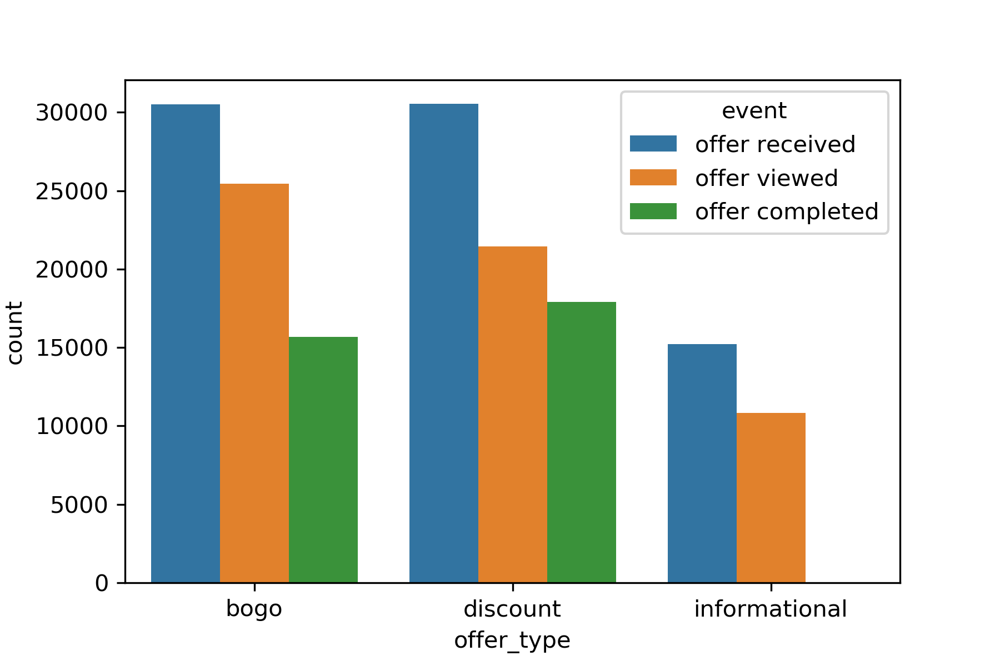

### Machine learning Engineer Nanodegree

# Capstone Project Report


Zhi Deng

Oct 29 2019

## Introduction

Starbucks Corporation is an American coffee company and coffeehouse chain. In reality, the Starbucks app sends out various types of promotional offers to customers, either discounts (BOGO or 50% off during happy hours) or Star Dash/menu challenges (completing required purchases to earn star rewards). Sometimes it also informs customers about limited-time drinks, such as those colorful Instagram Frappuccinos. As a marketing strategy, the goal of these promotional offers is to encourage customers to buy drinks at Starbucks and build loyalty among customers in the long run. Since Starbucks has a variety of products and customers' tastes also vary, it is important to send the right offer to the right customer by building a highly personalized recommendation system.

## Problem definition

In a simulated environment, Starbucks sends out three types of offers (BOGO, discount and informational) via multiple channels. Customers' responses to offers and transactions are recorded. The problem I proposed is to build a model to predict whether a customer will positively respond to a promotional offer. 

The data is provided by Starbucks and Udacity, in three JSON files:

#### profile.json
Rewards program users (17000 users x 5 fields)

* gender: (categorical) M, F, O, or null
* age: (numeric) missing value encoded as 118
* id: (string/hash)
* became_member_on: (date) format YYYYMMDD
* income: (numeric)

#### portfolio.json
Offers sent during 30-day test period (10 offers x 6 fields)

* reward: (numeric) money awarded for the amount spent
* channels: (list) web, email, mobile, social
* difficulty: (numeric) money required to be spent to receive reward
* duration: (numeric) time for offer to be open, in days
* offer_type: (string) bogo, discount, informational
* id: (string/hash)

#### transcript.json
Event log (306648 events x 4 fields)

* person: (string/hash)
* event: (string) offer received, offer viewed, transaction, offer completed
* value: (dictionary) different values depending on event type
	* offer id: (string/hash) not associated with any "transaction"
	* amount: (numeric) money spent in "transaction"
* time: (numeric) hours after start of test

The transcript will be processed to extract the responses from customers towards the promotional offers sent to them. With the response as labels, and properties of each customer and offer pair as features, a binary classifier can be trained to predict whether a customer will positively respond to a promotional offer. The prediction accuracy on a large unseen dataset can be used as one of the performance metrics. Besides, F1 score is a supplementary metric in case the response is highly imbalanced. Finally, a logistic regression will serve as the benchmark model, since it is possibly the most popular algorithm for binary classification problems in industry.

## Data analysis

#### `portfolio`

<table>
<thead>
<tr><th style="text-align: right;">  reward</th><th>channels                            </th><th style="text-align: right;">  difficulty</th><th style="text-align: right;">  duration</th><th>offer_type   </th><th>id                              </th></tr>
</thead>
<tbody>
<tr><td style="text-align: right;">      10</td><td>['email', 'mobile', 'social']       </td><td style="text-align: right;">          10</td><td style="text-align: right;">         7</td><td>bogo         </td><td>ae264e3637204a6fb9bb56bc8210ddfd</td></tr>
<tr><td style="text-align: right;">      10</td><td>['web', 'email', 'mobile', 'social']</td><td style="text-align: right;">          10</td><td style="text-align: right;">         5</td><td>bogo         </td><td>4d5c57ea9a6940dd891ad53e9dbe8da0</td></tr>
<tr><td style="text-align: right;">       0</td><td>['web', 'email', 'mobile']          </td><td style="text-align: right;">           0</td><td style="text-align: right;">         4</td><td>informational</td><td>3f207df678b143eea3cee63160fa8bed</td></tr>
<tr><td style="text-align: right;">       5</td><td>['web', 'email', 'mobile']          </td><td style="text-align: right;">           5</td><td style="text-align: right;">         7</td><td>bogo         </td><td>9b98b8c7a33c4b65b9aebfe6a799e6d9</td></tr>
<tr><td style="text-align: right;">       5</td><td>['web', 'email']                    </td><td style="text-align: right;">          20</td><td style="text-align: right;">        10</td><td>discount     </td><td>0b1e1539f2cc45b7b9fa7c272da2e1d7</td></tr>
<tr><td style="text-align: right;">       3</td><td>['web', 'email', 'mobile', 'social']</td><td style="text-align: right;">           7</td><td style="text-align: right;">         7</td><td>discount     </td><td>2298d6c36e964ae4a3e7e9706d1fb8c2</td></tr>
<tr><td style="text-align: right;">       2</td><td>['web', 'email', 'mobile', 'social']</td><td style="text-align: right;">          10</td><td style="text-align: right;">        10</td><td>discount     </td><td>fafdcd668e3743c1bb461111dcafc2a4</td></tr>
<tr><td style="text-align: right;">       0</td><td>['email', 'mobile', 'social']       </td><td style="text-align: right;">           0</td><td style="text-align: right;">         3</td><td>informational</td><td>5a8bc65990b245e5a138643cd4eb9837</td></tr>
<tr><td style="text-align: right;">       5</td><td>['web', 'email', 'mobile', 'social']</td><td style="text-align: right;">           5</td><td style="text-align: right;">         5</td><td>bogo         </td><td>f19421c1d4aa40978ebb69ca19b0e20d</td></tr>
<tr><td style="text-align: right;">       2</td><td>['web', 'email', 'mobile']          </td><td style="text-align: right;">          10</td><td style="text-align: right;">         7</td><td>discount     </td><td>2906b810c7d4411798c6938adc9daaa5</td></tr>
</tbody>
</table>

`portfolio` contains 10 different offers, categorized into 3 types (BOGO, discount and informational). 

#### `profile`

<table>
<thead>
<tr><th>gender  </th><th style="text-align: right;">  age</th><th>id                              </th><th style="text-align: right;">  became_member_on</th><th style="text-align: right;">  income</th></tr>
</thead>
<tbody>
<tr><td>        </td><td style="text-align: right;">  118</td><td>68be06ca386d4c31939f3a4f0e3dd783</td><td style="text-align: right;">          20170212</td><td style="text-align: right;">     nan</td></tr>
<tr><td>F       </td><td style="text-align: right;">   55</td><td>0610b486422d4921ae7d2bf64640c50b</td><td style="text-align: right;">          20170715</td><td style="text-align: right;">  112000</td></tr>
<tr><td>        </td><td style="text-align: right;">  118</td><td>38fe809add3b4fcf9315a9694bb96ff5</td><td style="text-align: right;">          20180712</td><td style="text-align: right;">     nan</td></tr>
<tr><td>F       </td><td style="text-align: right;">   75</td><td>78afa995795e4d85b5d9ceeca43f5fef</td><td style="text-align: right;">          20170509</td><td style="text-align: right;">  100000</td></tr>
<tr><td>        </td><td style="text-align: right;">  118</td><td>a03223e636434f42ac4c3df47e8bac43</td><td style="text-align: right;">          20170804</td><td style="text-align: right;">     nan</td></tr>
</tbody>
</table>

`profile` contains information of each customer. There are notable NaNs found for gender, age and income. Strategies to deal with these NaNs will be discussed in the next section.

#### `transcript`

Take a look at the transcript of a particular customer.

<table>
<thead>
<tr><th>person                          </th><th>event          </th><th>value                                                         </th><th style="text-align: right;">  time</th></tr>
</thead>
<tbody>
<tr><td>78afa995795e4d85b5d9ceeca43f5fef</td><td>offer received </td><td>{'offer id': '9b98b8c7a33c4b65b9aebfe6a799e6d9'}              </td><td style="text-align: right;">     0</td></tr>
<tr><td>78afa995795e4d85b5d9ceeca43f5fef</td><td>offer viewed   </td><td>{'offer id': '9b98b8c7a33c4b65b9aebfe6a799e6d9'}              </td><td style="text-align: right;">     6</td></tr>
<tr><td>78afa995795e4d85b5d9ceeca43f5fef</td><td>transaction    </td><td>{'amount': 19.89}                                             </td><td style="text-align: right;">   132</td></tr>
<tr><td>78afa995795e4d85b5d9ceeca43f5fef</td><td>offer completed</td><td>{'offer_id': '9b98b8c7a33c4b65b9aebfe6a799e6d9', 'reward': 5} </td><td style="text-align: right;">   132</td></tr>
<tr><td>78afa995795e4d85b5d9ceeca43f5fef</td><td>transaction    </td><td>{'amount': 17.78}                                             </td><td style="text-align: right;">   144</td></tr>
<tr><td>78afa995795e4d85b5d9ceeca43f5fef</td><td>offer received </td><td>{'offer id': '5a8bc65990b245e5a138643cd4eb9837'}              </td><td style="text-align: right;">   168</td></tr>
<tr><td>78afa995795e4d85b5d9ceeca43f5fef</td><td>offer viewed   </td><td>{'offer id': '5a8bc65990b245e5a138643cd4eb9837'}              </td><td style="text-align: right;">   216</td></tr>
<tr><td>78afa995795e4d85b5d9ceeca43f5fef</td><td>transaction    </td><td>{'amount': 19.67}                                             </td><td style="text-align: right;">   222</td></tr>
<tr><td>78afa995795e4d85b5d9ceeca43f5fef</td><td>transaction    </td><td>{'amount': 29.72}                                             </td><td style="text-align: right;">   240</td></tr>
<tr><td>78afa995795e4d85b5d9ceeca43f5fef</td><td>transaction    </td><td>{'amount': 23.93}                                             </td><td style="text-align: right;">   378</td></tr>
<tr><td>78afa995795e4d85b5d9ceeca43f5fef</td><td>offer received </td><td>{'offer id': 'ae264e3637204a6fb9bb56bc8210ddfd'}              </td><td style="text-align: right;">   408</td></tr>
<tr><td>78afa995795e4d85b5d9ceeca43f5fef</td><td>offer viewed   </td><td>{'offer id': 'ae264e3637204a6fb9bb56bc8210ddfd'}              </td><td style="text-align: right;">   408</td></tr>
<tr><td>78afa995795e4d85b5d9ceeca43f5fef</td><td>offer received </td><td>{'offer id': 'f19421c1d4aa40978ebb69ca19b0e20d'}              </td><td style="text-align: right;">   504</td></tr>
<tr><td>78afa995795e4d85b5d9ceeca43f5fef</td><td>transaction    </td><td>{'amount': 21.72}                                             </td><td style="text-align: right;">   510</td></tr>
<tr><td>78afa995795e4d85b5d9ceeca43f5fef</td><td>offer completed</td><td>{'offer_id': 'ae264e3637204a6fb9bb56bc8210ddfd', 'reward': 10}</td><td style="text-align: right;">   510</td></tr>
<tr><td>78afa995795e4d85b5d9ceeca43f5fef</td><td>offer completed</td><td>{'offer_id': 'f19421c1d4aa40978ebb69ca19b0e20d', 'reward': 5} </td><td style="text-align: right;">   510</td></tr>
<tr><td>78afa995795e4d85b5d9ceeca43f5fef</td><td>transaction    </td><td>{'amount': 26.56}                                             </td><td style="text-align: right;">   534</td></tr>
<tr><td>78afa995795e4d85b5d9ceeca43f5fef</td><td>offer viewed   </td><td>{'offer id': 'f19421c1d4aa40978ebb69ca19b0e20d'}              </td><td style="text-align: right;">   582</td></tr>
</tbody>
</table>

By looking at activities of one customer, one can easily find four types of events recorded in `transcript`, transactions and three types of offer activities. 

* 'offer received' marks the time when Starbucks sends the offer to the user, and the offer becomes effective instantly regardless whether the user has viewed it or not. 
* 'offer viewed' marks the time when user views the offer or becomes aware of it. Note that the user can still view the offer even if he/she has already completed without knowing it, as long as the time is still within the offer's duration. 
* 'offer completed' marks the time when the user makes qualified transaction meeting the requirement. The dict in the 'value' column has an additional key 'reward', which is associated with the offer id in `portfolio`.

```
>>> offer_log = transcript[transcript['event'].str.startswith('offer')]
>>> offer_log.loc[:, 'offer'] = offer_log['value'].apply(lambda c: c['offer id'] if 'offer id' in c else c['offer_id'])
>>> offer_log.drop(['value'], axis=1, inplace=True)
```

After filtering out transactions using the code above, I further analyzed offer activities with different offer types considered. From the count plot of events for different types of offers, one can easily observe that informational offers do not have completion events, possibly because there is no reward to claim. This is a key observation, as it will ultimately determine how `transcript` will be processed for different types of offers. 



Here are the **rules** I propose to label responses:

* A positive response requires both customer's awareness (viewed) and offer completion. The former must occur before the latter. 
* For informational offers, the response is determined from the number of transactions within the effective time window between viewed time and offer expiration. No transactions simply indicate a negative response. 

All the offer-customer pair will be traced from all the 'offer received' events.

```
>>> offer_receive = offer_log[offer_log['event'] == 'offer received']
>>> offer_receive['time'].unique() / 24
array([ 0.,  7., 14., 17., 21., 24.])
```

During the 30-day simulation, Starbucks only sends out six waves of offers. The time interval between offer waves varies from three days to a week. There are chances that multiple offers are effective in one customer's account since the offer durations are generally longer than the minimum interval. Processing `transcript` by person and unique offer id may reduce such complexity, but it is still tricky if the person has more than one active offers with the same id. 

```
>>> tmax = transcript.iloc[-1]['time']
>>> tmax / 24
29.75
```

In addition, the final wave of offers arrives on the 24th day, leaving less than six days in `transcript`. Some offers have longer duration and the final response remains unknown if they are not completed by the final time mark in `transcript`. Those offers will be dropped during processing.

```
>>> offer_receive.groupby(['person', 'offer']).count()['event'].value_counts()
1    51570
2    10523
3     1124
4       66
5        5
Name: event, dtype: int64
```

As a final remark, a unique customer-offer pair may have different responses since there are customers getting the same offer for more than once. Their responses may not necessarily remain the same. However, a model predicting customer-offer match should yield a unique output based on the input. Here I made a simple assumption that a customer likes an offer as long as a positive response is collected for more than once. 

## Solution implementation

### 1. Impute missing values in `profile`

Based on my observations, all the rows with NaNs in `profile` have gender and income as NaN, and age of 118. As already mentioned in the data source, 118 is the encoded missing value for age. Therefore, imputation is required for gender, age and income. The median of numerical fields (age and income) is used, and another label ('U' for unknown) is applied for gender. Finally, since the three fields are either all missing or full, only one column 'profile_nan' is added as an indication of missing values. `profile` after imputation is shown below.

<table>
<thead>
<tr><th>gender  </th><th style="text-align: right;">  age</th><th>id                              </th><th style="text-align: right;">  became_member_on</th><th style="text-align: right;">  income</th><th style="text-align: right;">  profile_nan</th></tr>
</thead>
<tbody>
<tr><td>U       </td><td style="text-align: right;">   55</td><td>68be06ca386d4c31939f3a4f0e3dd783</td><td style="text-align: right;">          20170212</td><td style="text-align: right;">   64000</td><td style="text-align: right;">            1</td></tr>
<tr><td>F       </td><td style="text-align: right;">   55</td><td>0610b486422d4921ae7d2bf64640c50b</td><td style="text-align: right;">          20170715</td><td style="text-align: right;">  112000</td><td style="text-align: right;">            0</td></tr>
<tr><td>U       </td><td style="text-align: right;">   55</td><td>38fe809add3b4fcf9315a9694bb96ff5</td><td style="text-align: right;">          20180712</td><td style="text-align: right;">   64000</td><td style="text-align: right;">            1</td></tr>
<tr><td>F       </td><td style="text-align: right;">   75</td><td>78afa995795e4d85b5d9ceeca43f5fef</td><td style="text-align: right;">          20170509</td><td style="text-align: right;">  100000</td><td style="text-align: right;">            0</td></tr>
<tr><td>U       </td><td style="text-align: right;">   55</td><td>a03223e636434f42ac4c3df47e8bac43</td><td style="text-align: right;">          20170804</td><td style="text-align: right;">   64000</td><td style="text-align: right;">            1</td></tr>
</tbody>
</table>

### 2. Process `transcript` to label responses

Implement a `label_response` method to process `transcript` with one particular customer-offer pair as the unit. First, add a 'positive_response' column to `offer_receive` with starting value 0 (negative), and then loop `label_response` through all appearing customers and offers sent to each one of them to label positively responded offers to 1. A few key ideas in addition to the proposed **rules** reflected in `label_response`:

* Use a queue to store active offers represented by a list `[t_receive, t_expire, t_viewed]` since offers have FIFO nature. Go through the offer activities by time, and pop offers completed or expired. 
* Treat informational offers differently. Besides the way a positive response is determined, the way to decide which offer is viewed when multiple offers (with same id) active. Label earlier BOGO, discount offers as viewed as offer chasers will complete them first to maximize their rewards. On the other hand, label later informational offers as viewed to extend the effective time window. 

Once the loop finishes, group `offer_receive` by 'person' and 'offer' using logic OR. After dropping other columns, a three-column dataframe appears to be the skeleton of the final dataset.

```
response = offer_receive.groupby(['person', 'offer']).any().reset_index()
response.drop(columns=['event', 'time'], inplace=True)
```

<table>
<thead>
<tr><th>person                          </th><th>offer                           </th><th>positive_response  </th></tr>
</thead>
<tbody>
<tr><td>0009655768c64bdeb2e877511632db8f</td><td>2906b810c7d4411798c6938adc9daaa5</td><td>False              </td></tr>
<tr><td>0009655768c64bdeb2e877511632db8f</td><td>3f207df678b143eea3cee63160fa8bed</td><td>False              </td></tr>
<tr><td>0009655768c64bdeb2e877511632db8f</td><td>5a8bc65990b245e5a138643cd4eb9837</td><td>False              </td></tr>
<tr><td>0009655768c64bdeb2e877511632db8f</td><td>f19421c1d4aa40978ebb69ca19b0e20d</td><td>False              </td></tr>
<tr><td>0009655768c64bdeb2e877511632db8f</td><td>fafdcd668e3743c1bb461111dcafc2a4</td><td>False              </td></tr>
</tbody>
</table>

### 3. Generate data for modeling


### 4. Build data transformer
### 5. Select optimal classification algorithm
### 6. Tune hyperparameters

## Results
A logistic regression model will serve as the benchmark model in this project. Logistic regression is possibly the most popular algorithm for binary classification problems in industry. 

## Conclusions
The performance of models will be measured using two metrics, accuracy and F1 score. 

### References
* [Starbucks - Wikipedia](https://en.wikipedia.org/wiki/Starbucks)
* [Logistic Regression - scikit-learn](https://scikit-learn.org/stable/modules/generated/sklearn.linear_model.LogisticRegression.html)
* [Accuracy score - scikit-learn](https://scikit-learn.org/stable/modules/generated/sklearn.metrics.accuracy_score.html)
* [F1 score - scikit-learn](https://scikit-learn.org/stable/modules/generated/sklearn.metrics.f1_score.html) 